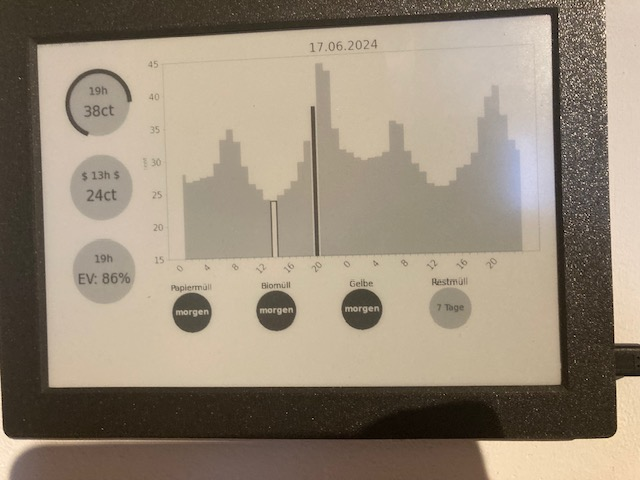

# Smart Home Dashboard


This project involved building a smart home dashboard displaying dynamic energy prices (current, lowest and next two 
days), EV charge stage, as well as the next trash collection for various bins (that last one might not be that smart, 
but at least as  useful).

# Physical Setup
## Material
- Display: 
I used an [Inkplate 10](https://soldered.com/de/produkt/soldered-inkplate-10-platine-mitdem-9-7-e-paper/) E-Ink display,
with a ESP32 Microcontroller, to ensure the power consumption of the process is minimal. The controller runs a 
micropython script.
- Server:
A Raspberry PI 3, But any other version of PI or an Arduino should do the trick without a heavy power draw.
## Configuration
Both the server and display need to be in the same Wifi network. The Inkplate 10 can likely be run for a couple of weeks
on a battery, otherwise it can be plugged in.

# Installation
## Config
Add your credentials in the sample files
```
credentials/google_credentials.json.sample
credentials/tibber_credentials.json.sample
credentials/calendar_config.json.sample
```
## Server
Please enter your preferred python environment manager and just run
```
pip -r requirements.txt
```
## Display
Add a `secrets.h` file to the [client arduino project](src/client/inkplate_10_dashboard) with the content
```c
// secrets.h
const char* ssid = "WLAN_SSID";
const char* pass = "PASSWORD";
```
and upload the folder to the Inkplate10 using ArduinoIDE for example.

# Running the setup
Run the FastAPI server on the pi:
```shell
python -m src.server.server
```
Just switch on the display, it will request the dashboard from the server after startup. If the server is not reachable 
the display will print a small error message and idle. Otherwise it will print the dashboad for ~5min and then sleep as 
instructed by the server.

There is an additional component to this application to retrieve the EV state of charge. I'm not making that part public for security reasons.
